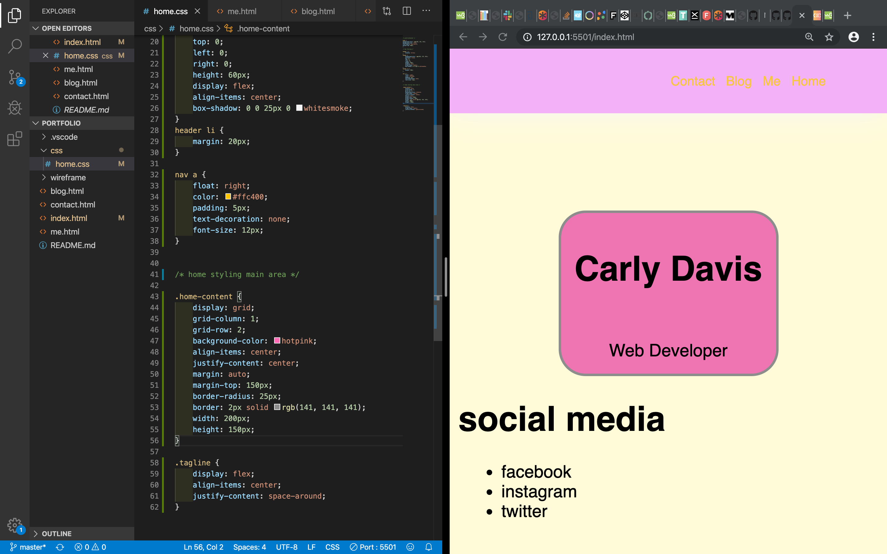

# Portfolio Assignment

##### Carly Davis

---

- [My Portfolio Website](https://www.carly-davis.netlify.com "Carly Davis Portfolio")
- [My Portfolio GitHub Repository](https://github.com/Carvis7/portfolioassignment "GitHub repo for Portfolio Assignment")

---

My Portfolio website is a showcase of the skills I have learned during term 1 at Coder-Academy.

The purpose of the website is to demonstrate my skills in HTML and CSS, and it will serve as a part of my resume when applying for jobs in the industry; as well as a platform for recruiters to reach out to me.

My portfolio website comprises of 4 main areas (pages).

My __'Home'__ page is a single layout page with my branding, my name, and a tagline depicting what I do. 
The right hand side of the navbar contains links to every other page in my portfolio, and my branding is situated on the left.

The navbar is the same on every page of my portfolio.

The __'Me'__ page in my portfolio is pretty self explanatory.
It contains all information about me, including my skills (programming languages I can use), my resume, a brief introduction about who I am, and what I hope to achieve in my career as a developer, and a section that showcases some projects that i've worked on.

The resume button contains a link to a PDF of my resume (mockup) that can be viewed and downloaded if the user pleases.

The __'Blog'__ page contains a grid with various covers of blog posts. Clicking on the cover will take the user to a new page with a stylised card of the corresponding blog post.
The blog post includes a button to go back to the main blog page. The navbar is still present, so the user does not need to utilise this button, it will mostly just be personal preference.

The __'Contact'__ page of my portfolio contains a form for users to input their details and request to get in contact with me. The form requires the users name, email address and a short explanation of their reason for getting in contact.
There is also a section containing various icons for social media with links to the page that is depicted by the icon. (These are not linked directly to my personal page, only to the main page of the network they represent.)

I have utilised various animations on the pages in my portfolio.
For example:
 - The background image on the main page has a small bounce animation that, I believe, brings the whole page to life. It's subtle, but has a rather big impact on the page.

 - The navbar has two animations that are triggered with every page refresh.
   - The branding 'CARVIS' on the left has a drop shadow that grows when the page is refreshed/loaded.
   - The links 'Home', 'Me', 'Blog', and 'Contact' have a 'slide-in' animation that is also triggered when the page is first loaded, and they slid-in from the right of the page and then maintain their position after the animation is finished.

- There are 'hover' animations on various objects on my website including the Blog covers, 'My Skills' icons, and the social media icons on my Contact page.

The main audience for my portfolio website is potential employers, coworkers/developers (for networking), and those looking for freelance services.

The techstack I used is:
* HTML5
* CSS3

and I deployed my website using Netlify with my GitHub Repository.

---

### Sitemap

---

### Development Screenshots

##### Wireframes

##### Development

